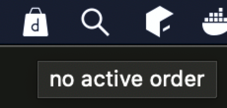
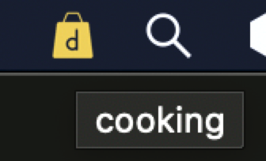
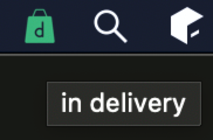

= food-delivery-notifier
:hardbreaks:

Tracks food delivery status, shows icon in status tray.

== Screenshots

== link:notebook.ipynb[Jupyter notebook]
Notebook with delivery time assessment, to make a prediction how fast food will be delivered.
[source]
----
conda activate base
pip3 install sklearn matplotlib geopandas
jupyter notebook
----

== Supported services

TBD

== Build

`go build github.com/EvilKhaosKat/food-delivery-notifier`
or
`go install github.com/EvilKhaosKat/food-delivery-notifier`
